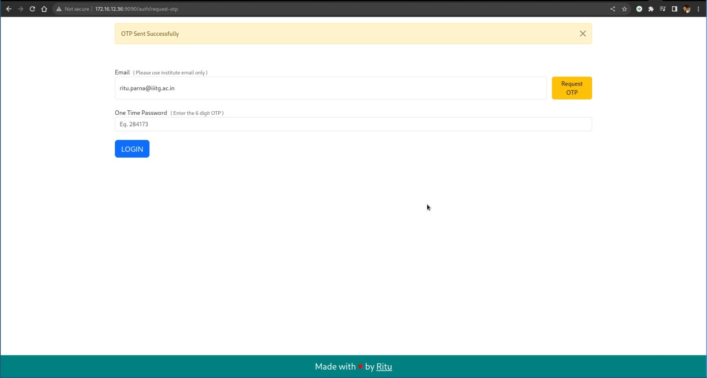
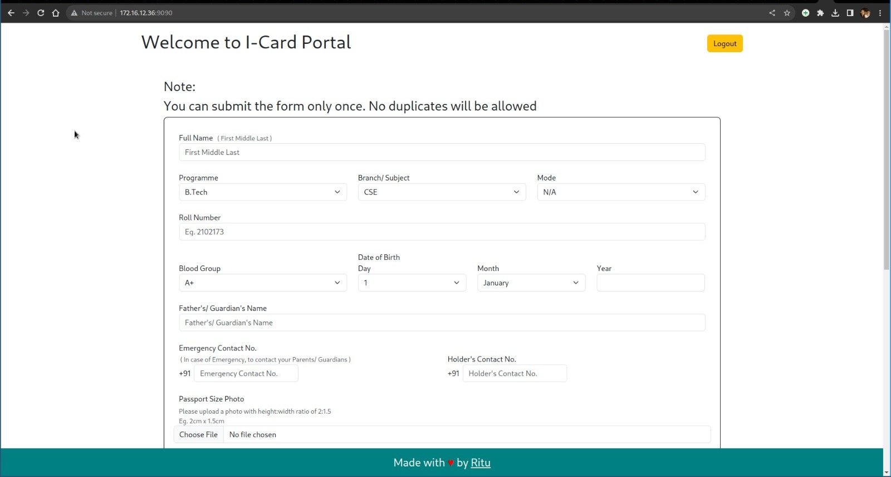
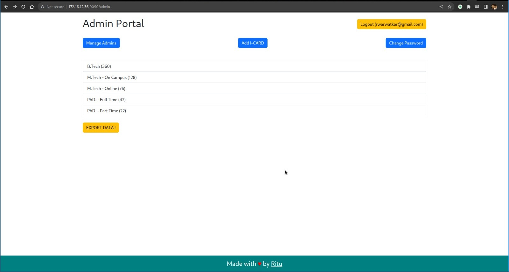
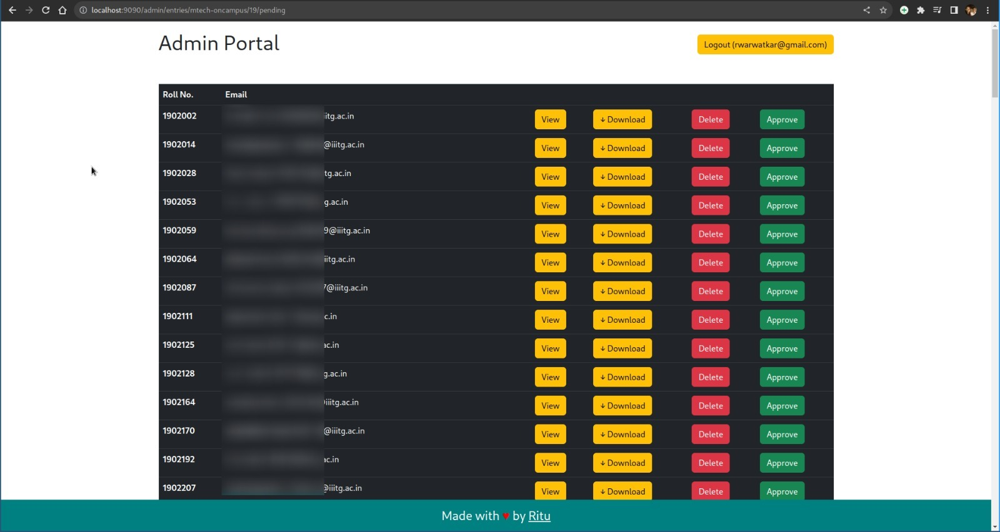

# IIIT Guwahati I-Card Management 
[]( # '')

An I-card generator and management application built using Node.js and MongoDB for the Indian Institute of Information Technology Guwahati (IIIT Guwahati). This application allows institute students to log in using their institute email IDs and fill out a form with the necessary details required for their institute ID cards. Once a student submits the form, administrators or authorized personnel can review the I-card requests, view the generated ID cards, and either approve or reject them.

This application has played a crucial role in streamlining the I-card generation and student data management processes at IIIT Guwahati. It has eliminated manual labor previously required for these tasks and automated the entire I-card generation process, resulting in increased efficiency and accuracy.

> On average, approximately 500 ID cards are generated annually through this application.

## Features

- **User Authentication:** Secure login system that allows students to log in using their institute email IDs only using One Time Passwords. (Initially implemented using Google OAuth but Google does not allow OAuth for on-premises infrastructure)

- **I-Card Request Form:** Students can fill out a form with the necessary details required for their ID cards.

- **Admin Dashboard:** Authorized administrators can view I-card requests, review generated ID cards, and approve or reject requests.

- **Automated I-Card Generation:** Once a administrator approves the request, I-Card is generated automatically.

- **Student Data Management:** Efficiently manage student data and I-card information in one centralized system.

## Technologies Used

- Backend: NodeJS, ExpressJS
- Database: MongoDB
- Frontend: HTML, CSS, JavaScript (EJS Templating Engine)
- U-2 Net Object Cropping model

## Installation

To get this project up and running on your local machine, follow these steps:

1. Clone the repository:

   ```
   git clone https://github.com/rituparna-ui/iiitg-icard.git
   ```

2. Change to the project directory:

   ```
   cd iiitg-icard
   ```

3. Install the project dependencies:

   ```
   npm install
   ```

4. Configure the application by providing necessary environment variables (e.g., database connection details, email authentication etc).

5. Start the application:

   ```
   npm start
   ```

Now you can access the application in your web browser at `http://localhost:3000`.

## Previews

### Login



### I-Card Request Form



### Admin Dashboard




